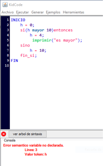
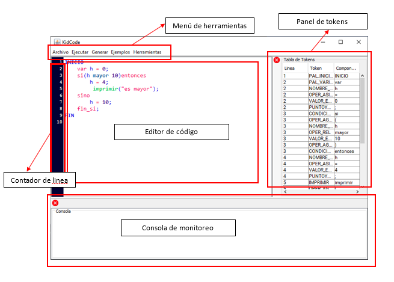

# Compilador en Java
Software que integra un compilador con las siguientes caracteristicas: 
- Analizador léxico, sintáctico y semántico
- Generador de código intermedio
- Generador del árbol sintáctico
- Gestion de errores e interfaz grafica para edición de código
# Requerimientos
Las librerias requeridas se encuentran en la carpeta librerias
- java-cup-11a.jar
- java-cup-11b.jar
- java-cup-11b-runtime.jar
- jflex-full-1.7.0.jar

Para generar el árbol sintactico y poder visualizarlo en formato png instalar:
- Graphviz2.38 https://graphviz.org/download/

# Capturas
### Estilos

### Interfaz

### Árbol sintactico

                      
### Código intermedio

